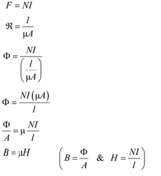
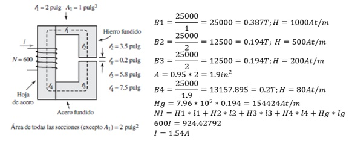
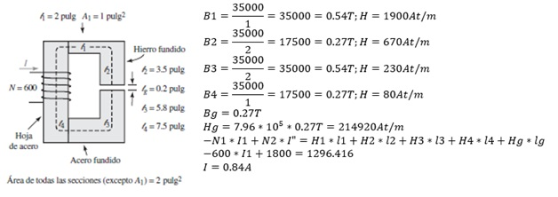
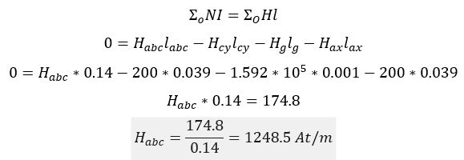
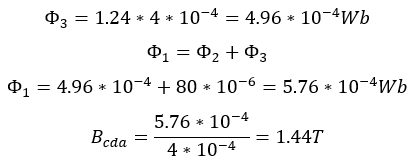

# Informe Tarea N°6

**Integrantes:**

Christian Bonifaz, Mateo Calderon, Josue Camacho, Luis Guevara

**NRC:** 5415

**Docente:** Ing. Darwin Alulema

**Tema:** Capitulo 11 (Carga, descarga del capacitor y circuitos formadores de onda simples) y capitulo 12 (Magnetismo y circuitos magnéticos) de Análisis de Circuitos - Robbins, Miller

### 1. OBJETIVOS

- Clarificar el estudio de carga, descarga del capacitor,circuitos formadores de onda simples, de la misma forma para Magnetismo y circuitos magnéticos todo esto aplicando los conocimientos aprendidos durante clases.

- Analizar y resolver circuitos magnéticos en serie, serie-paralelo, asi como tambien calcular la fuerza de atracción de un electroimán mediante las formulas y pasos estudiados en este capitulo

### 2. MARCO TEÓRICO

#### Capitulo 11 (Carga, descarga del capacitor y circuitos formadores de onda simples)

#### Capitulo 12 (Magnetismo y circuitos magnéticos)

### 3. EXPLICACIÓN Y RESOLUCIÓN DE EJERCICIOS O PROBLEMAS

#### Capitulo 11 (Carga, descarga del capacitor y circuitos formadores de onda simples)

**1. El capacitor de la figura 11-50 está descargado.
a. ¿Cuál es el voltaje y la corriente del capacitor justo después de que se cierra el
interruptor?
b. ¿Cuál es el voltaje y la corriente del capacitor después de que está totalmente cargado?**

**3. 	a. ¿A qué se parece un capacitor descargado en el instante que se conecta el
interruptor?
b. ¿Cómo se ve un capacitor cargado en el instante que se acciona el interruptor?
c. ¿A qué se parece un capacitor en estado estable de cd?
d. ¿Qué se quiere decir con i(0-) y con i(0+)?**

**5. Para un circuito de carga, R = 5.6 kΩ y vC (0-) = 0 V. Si i(0+) = 2.7 mA, ¿cuál es el valor de E?**

**7. Repita el problema 6 si R = 500 Ω, C = 25 µF y E = 45 V, pero ahora calcule y grafique valores en t = 0+ s, 20, 40, 60, 80 y 100 ms.**

**9. Repita el problema 8 para el circuito de la figura 11-52.**

**11. Determine la constante de tiempo para el circuito de la figura 11-50. ¿Cuánto tiempo (en segundos) tardará el capacitor en cargarse?**

**13. Para la figura 11-50, el voltaje del capacitor con el interruptor abierto es de 0 V. Cierre el interruptor en t = 0 y determine el voltaje y corriente del capacitor en t = 0, 40, 80, 120, 160 y 200 µs, use las curvas de la constante de tiempo universal.**

**15. Para la figura 11-2, la corriente se eleva a 3 mA cuando el interruptor se cierra. El capacitor tarda 1 s para cargarse. Si E = 75 V, determine R y C.**

**17. Para la figura 11-2, determine E, R y C si el capacitor tarda 5 ms en cargarse, la corriente en 1 constante de tiempo después de que el interruptor se cierra es de 3.679 mA, y el capacitor se carga a 45 volts en estado estable.**

**19. El capacitor de la figura 11-50 tiene un voltaje inicial. Si V0 = 10 V, ¿cuál es el corriente justo después de que el interruptor se ha cerrado?**

**21. Para el capacitor de la figura 11-51, V0 = 30 V.
a. Determine la expresión para el voltaje de carga vC.
b. Determine la expresión para la corriente iC.
c. Grafique vC e iC.**

**25. Un capacitor de 4.7 F se carga a 43 volts. Si un resistor de 39 kohm se conecta al capacitor, ¿cual es el voltaje, 200 ms despues de que se conecta el resistor?**

**27. Para la figura 11-54, sea E=200 V, R2=1 kohmy C=0.5 F. Despues de que el capacitor esta totalmente cargado en la posicion 1, el interruptor es movido a la posicion 2.
a. ¿Que voltaje tiene el capacitor inmediatamente despues de que el interruptor es movido a la posicion 2? ¿Cual es la corriente?
b. ¿Cual es la constante de tiempo de descarga?
c. Determine las ecuaciones de descarga para vC e iC.**

**29. Los capacitores de la figura 11-55 están descargados. El interruptor se cierra en t0. Determine la ecuación para vC. Calcule vC a una constante de tiempo usando la ecuación y la curva de constante de tiempo universal. Compare sus respuestas.**

**31. Repita el problema 30, del inciso (a) al (c) para el circuito de la figura 11-57.**

**35. Determine los voltajes del capacitor y la corriente de la fuente para el circuito de la figura 11-60 después de que se alcanzó el estado estable.**

**37. Para el circuito de alarma de la figura 11-32, si la entrada desde el sensor es de 5 V, R750 k y la alarma es activada en 15 s cuando vC 3.8 V, ¿Qué valor tiene C?**

**39. Considere la forma de onda de la figura 11-62.**

**a. ¿Cual es el periodo?**

**b. ¿Cual es el ciclo de trabajo?**

**c. ¿Cual es el PPR?**

**41. Determine el tiempo de subida, de bajada y el ancho de pulso para el pulso de la figura 11-64.**

**43. Se aplica un escalon al circuito de la figura 11-66. Si R150 y C20 pF, estime el tiempo que tarda en subir el voltaje de salida.**

#### Capitulo 12 (Magnetismo y circuitos magnéticos)

**1. Vea la figura 12-41:**

**a.	¿Qué área, A1 o A2, utilizará para calcular la densidad de flujo?**

Usamos el área A1 para calcular la densidad de flujo porque, la densidad se encuentra proporcionando el flujo total que pasa perpendicularmente a través de un área por el tamaño del área.

**b.	Si ϕ=28 mWb, ¿cuál es la densidad de flujo en teslas?**

**2.	Para la figura 12-41, si ϕ=250 uWb, A1 =1.25 pulg2 y A2=2.0 pulg2, ¿cuál es la densidad de flujo en unidades del sistema inglés?**

**3.	El toroide de la figura 12-42 tiene una sección transversal circular y ϕ=628Wb. Si r1=8 cm y r2=12 cm, ¿cuál es la densidad de flujo en teslas?**

**4.	Si r1 en la figura 12-42 mide 3.5 pulgadas y r2 mide 4.5 pulgadas, ¿cuál es la densidad de flujo en el sistema inglés de unidades si ϕ=628 uWb?**

**5.	Si la sección del núcleo en la figura 12-43 que mide 0.025 m por 0.04 m, tiene un factor de apilamiento de 0.85 y B=1.45 T, ¿qué valor tiene en webers?**

**6.	Para el núcleo de hierro de la figura 12-44, la densidad de flujo B2=0.6 T. Calcule B1 y B3.**

**7.	Para la sección del núcleo de hierro de la figura 12-45, si ϕ1=12 mWb y ϕ3=2 mWb, ¿cuánto vale B2?**

**8.	Para la sección de núcleo de hierro de la figura 12-45, si B1=0.8 T y B2=0.6 T, ¿qué valor tiene B3?.**

**9.	Un núcleo con dimensiones de 2 cm x 3 cm tiene una intensidad magnética de 1200 Av/m. ¿Qué valor tiene ϕ si el núcleo es de hierro fundido? ¿Si es de acero fundido? ¿Si es de hoja de acero con FA=0.94?.**

**10.	La figura 12-46 muestra los dos circuitos eléctricos equivalentes a los circuitos magnéticos. Demuestre que u en  R=l/uA es lo mismo que u en B=uH.**

**11.	Considere una vez más la figura 12-42. Si I=10 A, N=40 vueltas, r1=5 cm y r2=7 cm, ¿qué valor tiene H en amperes-vuelta por metro?**

**12.	Sean H1 y l1 la fuerza magnetizante y la longitud de la trayectoria, respectivamente, donde el flujo ϕ1 existe en la figura 12-47 y de forma similar para ϕ2 y ϕ3. Escriba la ley de Ampère alrededor de cada una de las ventanas.**

Aplicamos la ley para el buble 1

Ley circuital de amperios

**13.	Suponga que una bobina N2 que lleva la corriente I2 se añade al brazo 3 del núcleo que se muestra en la figura 12-47 y que produce un flujo dirigido hacia arriba. Sin embargo, suponga que el flujo neto en el brazo 3 aún va hacia abajo. Escriba las ecuaciones de la ley de Ampère para este caso.**

Aplicando la ley de Ampere en el bucle 1

Dado que el flujo por la bobina N, se dirige hacia arriba, el término será sustractivo, también vamos en sentido opuesto al flujo en el camino y los términos correspondientes también serán sustractivo

Aplicando la ley de Ampere para el bucle 2

**14.	Repita el problema 13 si el flujo neto en el brazo 3 va hacia arriba pero la dirección de ϕ1 y ϕ2 permanecen como en la figura 12-47.**

Aplicando la ley de Ampere para el bucle 1

Dado que el flujo producido por la bobina N2, se dirige hacia arriba, el término será aditivo, también van opuestos al flujo en el camino I2 y I3, los términos correspondientes también serán sustractivo 

Aplicando la ley de Ampere para el bucle 2

**15.	Encuentre la corriente I en la figura 12-48 si ϕ=0.16 mWb.**

**16. Deje todo igual que en el problema 15, excepto que la porción de acero fundido se reemplaza con una hoja laminada de acero con un factor de apilamiento de 0.85.**

**17. Se corta un espacio de 0.5 mm en la porción del núcleo de acero fundido de la figura 12-48. Encuentre la corriente para ɸ=0.128 mWb. No tome en cuenta el desbordamiento.**

**18. Se cortan dos espacios, cada uno de 1 mm, en el circuito de la figura 12-48, uno en la porción de acero fundido y el otro en la porción de hierro fundido. Determine la corriente para Ɵ=0.128 mWb. No tome en cuenta el desbordamiento.**

**19. El núcleo de hierro fundido de la figura 12-49 mide 1 cm x 1.5 cm, la= 0.3mm, la densidad de flujo del espacio de aire es de 0.426 T y N = 600 vueltas. Los extremos de la pieza tienen forma semicircular. Tomando en cuenta el desbordamiento, encuentre la corriente I.**

**20. Para el circuito de la figura 12-50, Ɵ=141 x uWb y N = 400 vueltas. El miembro inferior es una hoja de acero con un factor de apilamiento de 0.94, mientras que el resto es de acero fundido. Todas las piezas miden 1 cm x 1 cm. La longitud de la trayectoria del acero fundido es de 16cm. Encuéntrela corriente I.**

**21. Para el circuito de la figura 12-51, Ɵ=30 x uWb y N =2000 vueltas. No tome en cuenta el desbordamiento y encuentre la corriente I.**

**22. Para el circuito de la figura 12-52, Ɵ=25 000 líneas. El factor de apilamiento para la porción de la hoja de acero es de 0.95. Encuentre la corriente I.**

**23. Una segunda bobina de 450 vueltas con I2 = 4 amperes se devana en la porción de acero fundido de la figura 12-52. Su flujo esta en oposición al flujo producido por la bobina original. El flujo resultante es de 35 000 líneas en dirección contraria a la de las manecillas del reloj. Encuentre la corriente I1.**

24. Para la figura 12-53, si Φg = 80 x μWb, encuentre I.

25. Si el circuito de la figura 12-53 no tiene espacio y 	Φ3=0.2 mWb, encuentre I.

26. Un circuito magnetico de acero fundido con N = 2500 vueltas, I = 200 mA y un area de seccion transversal de 0.02 m^2  tiene un espacio de aire de 0.00254 m. Si se supone que 90% de la fmm aparece en el espacio, estime el flujo en el nucleo.

27. Si NI=644Av para el nucleo de acero fundido de la figura 12-54, encuentre el flujo, Φ.

28. Se corta un espacio de L= 0.004 m en el nucleo de la figura 12-54. Todo lo demas permanece igual. Encuentre el flujo, Φ.

29. Para el relevador de la figura 12-34, si la cara del polo mide 2 cm por 2.5 cm y se requiere una fuerza de 2 libras para cerrar el espacio, ¿cuanto flujo se necesita (en webers)?

30. Para el solenoide de la figura 12-28, Φ=4x10^(-4) Wb. Encuentre la fuerza de atraccion en el embolo en newtons y en libras.

### 4. VIDEO

[Problemas Capítulos 11 y 12 - Informe Tarea N°6](https://youtu.be/h6EAohD4aG0 "Problemas Capítulos 11 y 12 - Informe Tarea N°6")

### 5. CONCLUSIONES 

- Mediante los conceptos y ejercicios vistos en este capitulo podemos entender de mejor manera cual es el proceso de desmagnetización, asi como tambien, la teoría de dominio del magnetismo y por ultimo qué son los circuitos magnéticos y por qué se utilizan.

- Se puede concluir que mediante distintos tipos de ejercicios propuestos sea por carga, descarga del capacitor,circuitos formadores de onda simples o por Magnetismo y circuitos magnéticos que lo aprendidio en clases se ha clarificado.

### 6. BIBLIOGRAFÍA

Robbins, A., & Miller, W. (2008). Análisis de circuitos. Estados Unidos: Cengage Learning.
