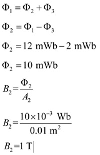

# Informe Tarea N°6

**Integrantes:**

Christian Bonifaz, Mateo Calderon, Josue Camacho, Luis Guevara

**NRC:** 5415

**Docente:** Ing. Darwin Alulema

**Tema:** Capitulo 11 (Carga, descarga del capacitor y circuitos formadores de onda simples) y capitulo 12 (Magnetismo y circuitos magnéticos) de Análisis de Circuitos - Robbins, Miller

### 1. OBJETIVOS

- Clarificar el estudio de carga, descarga del capacitor,circuitos formadores de onda simples, de la misma forma para Magnetismo y circuitos magnéticos todo esto aplicando los conocimientos aprendidos durante clases.

### 2. MARCO TEÓRICO

#### Capitulo 11 (Carga, descarga del capacitor y circuitos formadores de onda simples)

#### Capitulo 12 (Magnetismo y circuitos magnéticos)

### 3. EXPLICACIÓN Y RESOLUCIÓN DE EJERCICIOS O PROBLEMAS

#### Capitulo 11 (Carga, descarga del capacitor y circuitos formadores de onda simples)

#### Capitulo 12 (Magnetismo y circuitos magnéticos)

**1. Vea la figura 12-41:**

**a.	¿Qué área, A1 o A2, utilizará para calcular la densidad de flujo?**

Usamos el área A1 para calcular la densidad de flujo porque, la densidad se encuentra proporcionando el flujo total que pasa perpendicularmente a través de un área por el tamaño del área.

**b.	Si ϕ=28 mWb, ¿cuál es la densidad de flujo en teslas?**

**2.	Para la figura 12-41, si ϕ=250 uWb, A1 =1.25 pulg2 y A2=2.0 pulg2, ¿cuál es la densidad de flujo en unidades del sistema inglés?**

**3.	El toroide de la figura 12-42 tiene una sección transversal circular y ϕ=628Wb. Si r1=8 cm y r2=12 cm, ¿cuál es la densidad de flujo en teslas?**

**4.	Si r1 en la figura 12-42 mide 3.5 pulgadas y r2 mide 4.5 pulgadas, ¿cuál es la densidad de flujo en el sistema inglés de unidades si ϕ=628 uWb?**

**5.	Si la sección del núcleo en la figura 12-43 que mide 0.025 m por 0.04 m, tiene un factor de apilamiento de 0.85 y B=1.45 T, ¿qué valor tiene en webers?**

**6.	Para el núcleo de hierro de la figura 12-44, la densidad de flujo B2=0.6 T. Calcule B1 y B3.**

**7.	Para la sección del núcleo de hierro de la figura 12-45, si ϕ1=12 mWb y ϕ3=2 mWb, ¿cuánto vale B2?**

**8.	Para la sección de núcleo de hierro de la figura 12-45, si B1=0.8 T y B2=0.6 T, ¿qué valor tiene B3?.**

**9.	Un núcleo con dimensiones de 2 cm x 3 cm tiene una intensidad magnética de 1200 Av/m. ¿Qué valor tiene ϕ si el núcleo es de hierro fundido? ¿Si es de acero fundido? ¿Si es de hoja de acero con FA=0.94?.**

**10.	La figura 12-46 muestra los dos circuitos eléctricos equivalentes a los circuitos magnéticos. Demuestre que u en  R=l/uA es lo mismo que u en B=uH.**

**11.	Considere una vez más la figura 12-42. Si I=10 A, N=40 vueltas, r1=5 cm y r2=7 cm, ¿qué valor tiene H en amperes-vuelta por metro?**

**12.	Sean H1 y l1 la fuerza magnetizante y la longitud de la trayectoria, respectivamente, donde el flujo ϕ1 existe en la figura 12-47 y de forma similar para ϕ2 y ϕ3. Escriba la ley de Ampère alrededor de cada una de las ventanas.**

Aplicamos la ley para el buble 1

Ley circuital de amperios

**13.	Suponga que una bobina N2 que lleva la corriente I2 se añade al brazo 3 del núcleo que se muestra en la figura 12-47 y que produce un flujo dirigido hacia arriba. Sin embargo, suponga que el flujo neto en el brazo 3 aún va hacia abajo. Escriba las ecuaciones de la ley de Ampère para este caso.**

Aplicando la ley de Ampere en el bucle 1

Dado que el flujo por la bobina N, se dirige hacia arriba, el término será sustractivo, también vamos en sentido opuesto al flujo en el camino y los términos correspondientes también serán sustractivo

Aplicando la ley de Ampere para el bucle 2

**14.	Repita el problema 13 si el flujo neto en el brazo 3 va hacia arriba pero la dirección de ϕ1 y ϕ2 permanecen como en la figura 12-47.**

Aplicando la ley de Ampere para el bucle 1

Dado que el flujo producido por la bobina N2, se dirige hacia arriba, el término será aditivo, también van opuestos al flujo en el camino I2 y I3, los términos correspondientes también serán sustractivo 

Aplicando la ley de Ampere para el bucle 2

**15.	Encuentre la corriente I en la figura 12-48 si ϕ=0.16 mWb.**

### 4. VIDEO

### 5. CONCLUSIONES 

### 6. BIBLIOGRAFÍA

Robbins, A., & Miller, W. (2008). Análisis de circuitos. Estados Unidos: Cengage Learning.
